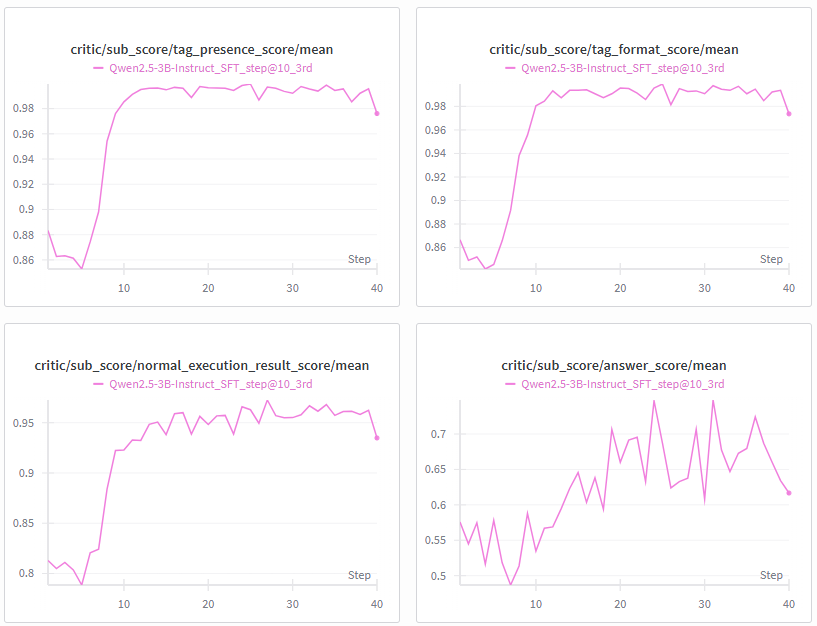
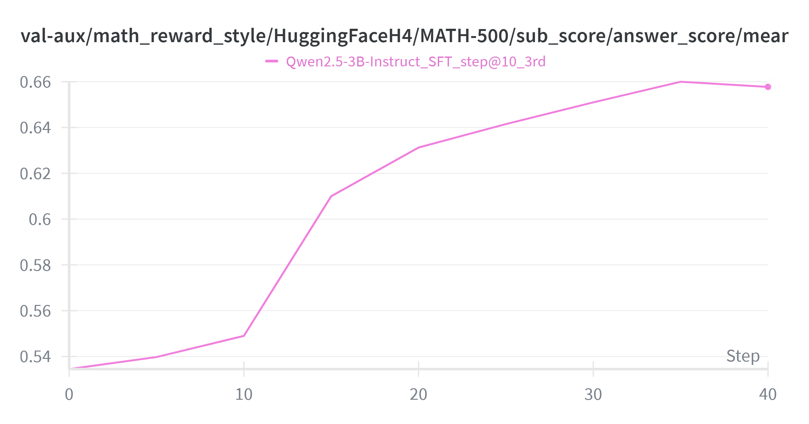
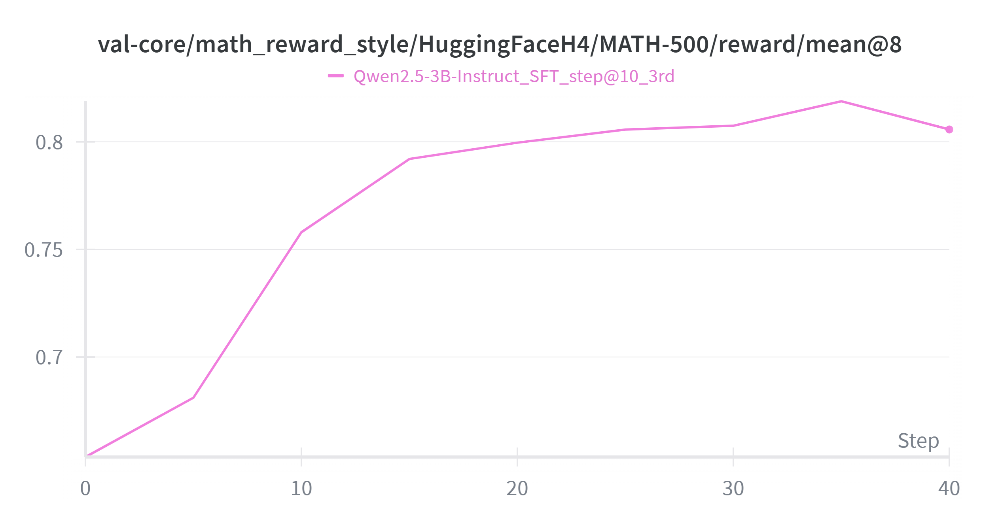

# Code-Integrated-Reasoning

## preliminary

For CIR-related papers, here are some early paper:
- Towards Effective Code-Integrated Reasoning
- ToRL: Scaling Tool-Integrated RL
- SimpleTIR: End-to-End Reinforcement Learning for Multi-Turn Tool-Integrated Reasoning

This repo is basically built upon **verl 0.6.0** (https://github.com/volcengine/verl). Please follow the official installation guide to install the environments, and this repo contains the necessary verl files for building environment. Install script is located at `scripts/install_vllm_sglang_mcore.sh`. 


# Important code

I implement following codes:
1. code interpreter based on `exec`, I also test code interpreter based on KernelManager but eventually reject it due to unstable code execution and kernel init. Located at `cir_utils/python_interpreter.py`.
2. Code-integrated generation function: Unlike search-R1 wrapping generation with `actor_rollout_wg.generate_sequences`, I choose to wrap generation with vllm.LLM in `verl/workers/rollout/vllm_rollout/vllm_rollout_spmd.py`, in which I only change the generation func. And the main code-integrated generation `code_integrated_generate` is located at `cir_utils/generate_utils.py`.

Here is one code-integrated generation example:
```markdown
To solve the expression \(\frac{x^4 + 2y^2}{6}\) given \(x = 2\) and \(y = 5\), we can substitute the values of \(x\) and \(y\) into the expression and then compute the result.

Let's break this down step-by-step:

1. Substitute \(x = 2\) and \(y = 5\) into the expression.
2. Calculate \(x^4\).
3. Calculate \(2y^2\).
4. Add the results from steps 2 and 3.
5. Divide the result from step 4 by 6.

Let's perform these calculations.
<python_interpreter>
x = 2
y = 5

# Step 2: Calculate x^4
x_power_4 = x**4

# Step 3: Calculate 2y^2
two_y_power_2 = 2 * y**2

# Step 4: Add the results from steps 2 and 3
sum_result = x_power_4 + two_y_power_2

# Step 5: Divide the result from step 4 by 6
final_result = sum_result / 6

final_result
</python_interpreter>
<execution_result>
11.0
</execution_result>
Therefore, the value of \(\frac{x^4 + 2y^2}{6}\) when \(x = 2\) and \(y = 5\) is \(\boxed{11}\).
```


I made following changes to verl code:
1. Data processing: I alter prompt logic from vanilla datasets. I seperate question from output format, which is essentially for score calculation. Hence, I use output format instruction and tool usage instruction as system prompt, while user prompt is solely the question itself. I change the data source setting during data process, with output format as prefix, and related score-computing routing in `default_compute_score` at `verl/utils/reward_score/__init__.py`.
2. Tokenize logic: Since I introduce tags such as `<python_interpreter>`, whose subword may be tokenized along with the context nearby and disrupt tag logic, and I cannot simplily add these tags into tokenizer words (model dim must change in this way), I use new encode function to ensure specially tags are independently tokenized. See `encode_with_tag` at `cir_utils/encode_utils.py`. 
3. Loss mask in both SFT and RL: I use special tags to wrapp code for execution and execution results. Since execution results are directly appended rather than generated by LLM, such tokens should be masked. 
	- In SFT, I use special tags to locate execution-related token ids. Located at `encode_and_mask` at `cir_utils/encode_utils.py`. Used at `MultiTurnSFTDataset.__getitem__` at `verl/utils/dataset/multiturn_sft_dataset.py`. 
	- In RL, I keep track of tokens generated by LLM and those belonging to execution results during generation. Located at `GenerationInfoManager.append_execution` at `cir_utils/generate_utils.py`. 
4. Reward design: Initally, verl provides binary reward signal, which compares model answer with ground truth and return 0/1. We initally use this original reward design, i.e., `default_compute_score` at `verl/utils/reward_score/__init__.py`. But during experiments, model training is always untable, sometimes code execution count is reduced to zero, which means model is trying to do normal reasoning instead of code-intergrated reasoning. Sometimes it is followed by abnormal performance collapse. Therefore, I follow verl documentation on custom reward design, and implments a complex reward as `compute_cir_score` in `cir_utils/reward_score.py`, including follows:
	- tag presense score: similar to R1 tag reward, checking whether target tags exist.
	- tag format score: similar to R1 thinking format (i.e., `<think>...</think><answer>...<\answer>`), I check whether code execution tags are properly formated, i.e., (i.e., `<python_interpreter>...</python_interpreter><execution_result>...<\execution_result>`). If a model is not properly trained, it is likely to output erroneous tag pattern, such as output `<execution_result>` by itself rather than output `</python_interpreter>` first, which is not expected. This pattern is allowed to occur multiple times, I do not care how many times model use code interpreter, as long as the format is correct. I also punish model if any redundant tags are generated.
	- normal execution result score: execution result should be normal, i.e., not error message (maybe corresponding code has error) or blank (if a code's return is blank, it is likely that either model forget to output variables in code or this code does not provide info, thus the meaning of code is lost). The score is calculated as the percentage of normal execution among all executions.
	- final answer score: similar to verl original reward, I compare model answer with ground truth answer and return 0/1. 
The ratio can be modified to your likes. Normally RL only require the final score, which is the weighted sum of above scores, but I also return these sub-scores for better analysis. For saving corresponding scores, make sure you return a dict including these sub-scores besides final score in `compute_cir_score`. I also add corresponding sub-scores stat calculations `compute_data_metrics` in `verl.trainer.ppo.metric_utils`. Newly appended metrics begins with 'sub_score/' and 'code_integrated_generation/', such as `critic/sub_score/tag_presence_score`. 

# Expeiment Results

Here is my recipe for training a code-integrated reasoning model on MathQA dataset with code interpreter tool.
1. Rejection Sampling SFT: I test 3 Qwen 2.5-Instruct-series models for direct code-integrated reasoning based on instruction. Qwen 2.5-Math-series are aslo tested but they are less instruction following than Instruct-series. Basically, they are impossible to perform code-integrated reasoning without SFT. The results are shown below:

| model                        | data_source           | code execution counts mean@4 | answer scores mean@4   |
|------------------------------|-----------------------------|--------------|------------|
| Qwen2.5-1.5B-Instruct         | MATH-lighteval/train       | 0.0268       | 0.5232     |
| Qwen2.5-3B-Instruct           | MATH-lighteval/train       | 0.5807       | 0.6480     |
| Qwen2.5-7B-Instruct           | MATH-lighteval/train       | 0.1240       | 0.7448     |

A pacular finding is that larger model does not necessarily has better instruction following in every way, at least code-integrated reasoning. Qwen 2.5-3B-Instruct performs the best in terms of using code, while Qwen 2.5-7B-Instruct performs the best in terms of answer scores. 

We sample 4 outputs per question during inference, and filter data according to final answer correctness as well as whether using code for reasoning. I collect around 3k from 3B-Instruct and 2k from 7B-Instruct. Eventually I train 3B for 10 steps (batch size 256, approximately 2.5k samples). I will show corresponing SFT results along with RL results later.

2. GRPO training: I train SFT model, namely Qwen2.5-3B-Instruct(SFT_step@10), for 40 RL steps (batch size 128). The results are shown below:

|    | model                                          | data_source            |   scores_mean@4 |   scores_pass@4 |   scores_pass@1 |
|---:|:-----------------------------------------------|:-----------------------|----------------:|----------------:|----------------:|
|  0 | Qwen2.5-3B-Instruct                            | MATH-lighteval (train) |          0.5395 |          0.7657 |          0.5385 |
|  1 | Qwen2.5-3B-Instruct(SFT_step@10)               | MATH-lighteval (train) |          0.5447 |          0.754  |          0.5519 |
|  2 | Qwen2.5-3B-Instruct(SFT_step@10, GRPO_step@50) | MATH-lighteval (train) |          0.6596 |          0.7687 |          0.656  |
|  3 | Qwen2.5-3B-Instruct                            | MATH-lighteval (test)  |          0.4954 |          0.742  |          0.5006 |
|  4 | Qwen2.5-3B-Instruct(SFT_step@10)               | MATH-lighteval (test)  |          0.4995 |          0.7166 |          0.4986 |
|  5 | Qwen2.5-3B-Instruct(SFT_step@10, GRPO_step@50) | MATH-lighteval (test)  |          0.6268 |          0.7492 |          0.6184 |
|  6 | Qwen2.5-3B-Instruct                            | MATH-500 (test)        |          0.4035 |          0.676  |          0.416  |
|  7 | Qwen2.5-3B-Instruct(SFT_step@10)               | MATH-500 (test)        |          0.478  |          0.7    |          0.474  |
|  8 | Qwen2.5-3B-Instruct(SFT_step@10, GRPO_step@50) | MATH-500 (test)        |          0.662  |          0.788  |          0.672  |

Since the SFT data and RL data are all from the same dataset MATH-lighteval (train), and model is fine-tuned with its own correct data, SFT model do not have obvious improvement on MATH-lighteval (train). But it indeed improve a bit on MATH-500. 
But after RL training, model improves a lot on both three datasets, showing the effectiveness of RL fine-tuning. 

Here are some metric stats. 
1. Four sub-scores mean value per batch during RL training:


2. Answer score and Final score (weighted sum of sub-scores) on evalset during RL training:




# Advise for RL rewards

After experiment, I find that you shouldn't use complex rewards for RL, as they are hard to learn. For example, I add answer quality score (scored by another LLM) to evaluate the quality (just completeness alike without correctness) of formal answer (after `</think>` tag), and it cause RL to be unstable. Because this reward is only associated with answer formulation, it should only applied to answer tokens, but due to sparse reward, this reward applys to all tokens, including correct reasoning tokens, which may cause model to be confused about whether it should optimize reasoning or answer formulation. And since answer formulation is more abstract and less directly related to final answer correctness than reasoning, it is harder to learn. 

My suggestion is to ensure the model outputs in a good format during the SFT phase (which should remain stable during the whole training process), and only use accuracy-based rewards for RL, which are easier to learn and can also achieve good performance. 
By good format, I generally mean explicit format (use tags) and inexplicit format (such as answer pattern, hard to learn in outcome-based RL).


# Reproduction procedure

Follow these steps to reproduce the results:
1. Install verl and other dependencies.
2. Run code cells in `data_preprocess/run_build.ipynb` to build verl-style dataset for inference and RL training. 
3. Download Qwen 2.5-Instruct models from official source and run `bash exp_scripts/run_infer.sh`, which produce raw inference data.
4. Select code-integrated reasoning samples from raw data and produce SFT data. Run `bash exp_scripts/run_select_infer_data.sh`.
5. Run SFT training: `bash exp_scripts/run_sft.sh`. Once SFT is done, you can run `bash exp_scripts/run_merge_fsdp.sh` to merge FSDP checkpoints into normal checkpoint for easier inference.
6. Run RL training: `bash exp_scripts/run_rl.sh`. 

Remember to modify variables in scripts according to your setting. 


# Extension to R1-format model

I find function calling capacity of model is crucial for code-integrated reasoning, since it is the basis for model to use code interpreter tool. 
DeepSeek-R1-Distill-Qwen-7B/14B seems to not have any function calling capacity, which may be the reason why they are less instruction-following than Qwen instruct-series models, and basically impossible to do code-integrated reasoning just based on instruction.
Qwen3-series models have function calling capacity, and they can do do code-integrated reasoning but also face some issues such as not print middle variables and poorly explained answer. 
I use GPT5.2 to merge the normal reasoning answer and code-integrated reasoning answer from Qwen3-series, and produce pseudo code-integrated reasoning data. Below is the prompt I used for merge:

```markdown
	I have two assistant responses for the same problem. One is to use default natural language reasoning (NLR) to solve the problem, and the other one is to use code-integrated reasoning (CIR) to solve the problem. Both answers are correct but the reasoning pattern and solving process are different. Both follow R1-format (<think>...thinking content...</think>...answer content...).

	## problem

	{problem}

	## NLR instruction

	```markdown
	Let's think step by step and output the final answer within \boxed{{}}.
	```

	## NLR response

	```markdown
	{NLR_response}
	```

	## CIR instruction

	```markdown
	During your reasoning, you can use python code to perform logic and calculations. And you should always trust the execution result returned by the code executor. After receiving the execution result, you can choose to write more code if needed. 
	If you decide to use python code, you must write python code between the tags <python_interpreter> and </python_interpreter>, such as <python_interpreter>
	# pure python code only (NO backticks, NO markdown, NO prose, NO extra tags)
	</python_interpreter>. 
	The code is meant for returning textual output, so plot-related code should be avoided. Meanwhile you should avoid output variables that are too large, such as long lists or big dataframes, to prevent the output from being too long. If you want to check the content of a variable, you can print part of it, such as the first 10 elements of a list or the first few rows of a dataframe. 
	The code executor will run your code and return the output (stdout / plain text / error message) back to you between the tags <execution_result> and </execution_result> to support your reasoning process. You will continue your reasoning after receiving the execution result. 
	Notes that python interpreter should only be used within the reasoning content, not in formal answer. 
	Remember that execution result is not formal enough as final answer and you need to follow the output format instructions to provide your final answer. 
	Let's think step by step and output the final answer within \boxed{{}}.
	```

	## CIR response

	```markdown
	{CIR_response}
	```
	
	Model may try to use code interpreter but omit without tags and end up use natural language to simulate its execution, which should be revised to put code within <python_interpreter> and </python_interpreter>. Model may also try to output some intermediate variables in the execution result, which should be revised to add some print statements in the code to output those variables.
	Notes that plot-related code should be avoided, because the code is meant for returning textual output. Meanwhile you should avoid output variables that are too large, such as long lists or big dataframes, to prevent the output from being too long. If you want to check the content of a variable, you can print part of it, such as the first 10 elements of a list or the first few rows of a dataframe. 
	And code interpreter usage should be merged into the reasoning process in a more natural way (and also contained within the reasoning content), rather than being separated as an independent step that is only used to verify the final answer. 

	# task

	I want you to first judge whether the CIR response uses code interpreter in a meaningful way to solve the problem (post-hoc validation is meaningful, but later should be revised to directly use code interpreter). Ouput <check_meaningful>yes/no</check_meaningful> to indicate whether the CIR response uses code interpreter in a meaningful way to solve the problem. If the CIR response does not use code interpreter in a meaningful way, you don't have to revise answer. Otherwise, you should revise CIR response according to following instructions.

	I want to formalize CIR response to follow CIR instruction more strictly. Overall, I want the answer content to follow NLR, in a more formal way without code interpreter usage, while the reasoning content to follow CIR instruction, which should have code interpreter usage to solve the problem. You should merge code interpreter usage from CIR response into the reasoning pattern of NLR response, and make the reasoning pattern more clear and complete. You can add some reasoning steps to connect the code interpreter usage, but you should not change the solving process of CIR response too much. You should keep the main solving process of CIR response unchanged, but you can refine the code to make it more clear and complete, such as adding some print statements to output intermediate variables. You should avoid adding new solving process that is not in CIR response, but you can add some reasoning steps to connect the code interpreter usage in a more natural way. 
	This answer is likely to first perform normal reasoning to get a answer and then use code interpreter to verify the answer or calculate some intermediate variables. I do no prefer this pattern. Instead, I want model to just directly use code interpreter to solve the problem, nevertheless model can still use reasoning to first plan the steps. So please refine the answer to make it more like this pattern. 

	Below is the format of the response want to get:
	```markdown
	<think>
	...
	<python_interpreter>
	...
	</python_interpreter>
	<execution_result>
	...
	</execution_result>
	...
	</think>
	<answer>
	...
	</answer>
	```
	Notes that the response style should be close to the NLR response. And answer content should be formal and detailed as NLR response, while reasoning content should have code interpreter usage to solve the problem.

	first output <check_meaningful>yes/no</check_meaningful>, then output a markdown code block with revised CIR response if needed.
```

I find GPT rewrited answer is much more clear. So I suggest to use same trick on non-R1-format model answer to produce better SFT data.

